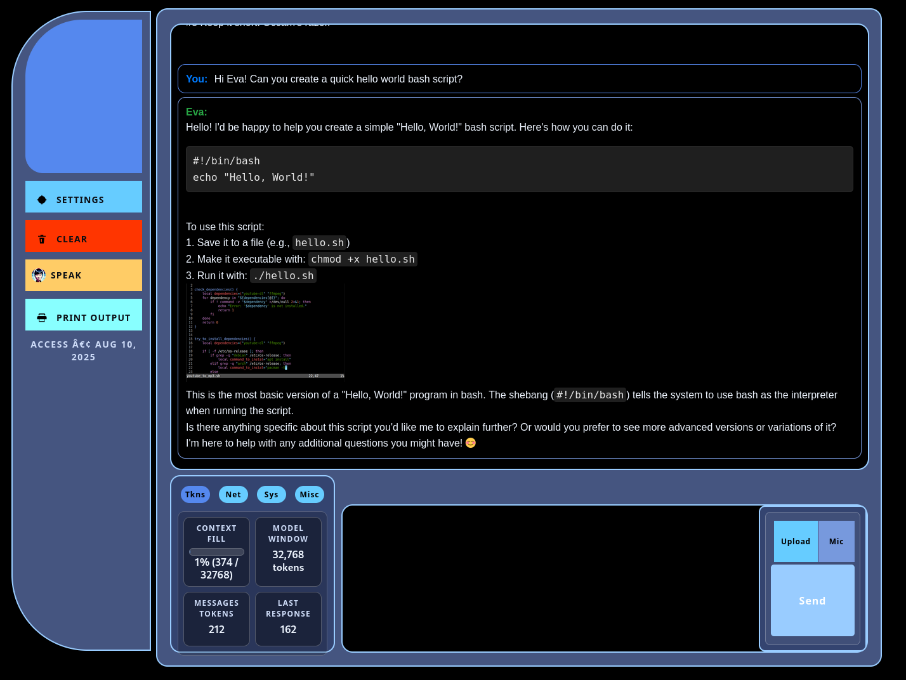

# ChatGPT HTML - Using OpenAI APIs; 


v.4.0

This allows you to easily interact with OpenAI and Google Generative APIs.

## Getting Started

1. Add your OpenAI API key to the "```OPENAI_API_KEY```" variable and (optionally) AWS, Google Keys in ```config.json``` for additional functionality. 
2. Open ```index.html``` and have fun!
	- If opening via file://, copy `config.local.example.js` to `config.local.js` and set your keys there (no fetch needed).
	- Or, serve over http(s) and keep using `config.json`.
3. Optional: - Suno-Ai's Bark TTS Engine. Run ```server.py``` (GPU Enabled)
4. **Note: You may have to review/adjust the code for your specific env. ie ```CIDR ranges```, ```NGINX/webserver``` configuration,```scripting``` piece etc.**
5. Local usage without a server:
	- Copy `config.local.example.js` to `config.local.js` and fill your keys.
	- Open `index.html` directly (file://). No fetch call to config.json is needed.
   
## Features

- Keeps conversation memory
- OpenAI ```o1```, ```o1-*``` models
- OpenAI ```o3-mini``` model added (great for code - tier 4+ API)
- OpenAI ```gpt-4o``` models
- OpenAI `gpt-5-mini` (experimental) and `latest` alias (per OpenAI latest-model guidance)
- GitHub Copilot Models API (GPT-4o, o3-mini via GitHub PAT)
- GitHub Copilot ACP Bridge (uses your Copilot license — access to GPT-4o, Claude, Gemini, and more via `acp_bridge.py`)
  - Auto-detects bridge on same server, localhost, or custom URL
  - Systemd service: `sudo ./acp_setup.sh` (requires 64-bit server)
  - Local mode: `python3 acp_bridge.py` on any 64-bit machine
- Latest Google Gemini 2.0 ```Thinking``` model
- [lmstudio API](https://lmstudio.ai/docs/api/openai-api) local models 
- Dall-E Image Generation
- Google Vision 
- Model Selection, Multiple languages, and Print Conversation.
- Convert to Speech using Amazon Polly's Text-to-Speech service.
- Suno-Ai's Bark TTS Engine available
- Use Google Search with the Keyword "Google"
- Images served with Google Image Search
- Additional scraped data with scripts
- Basic Error handling

## Contributing

See `.github/copilot-instructions.md` for contribution guidance and model wiring conventions.

## Bugs
- Check Issues
- Response with ```"usage":{"completion_tokens":420}``` causes weird display bug on-screen.
- **Not for Production use (really messy code, likely security concerns, all-over-the-place, good playgroud and learning tho!)**

Grabbed the inital idea from here https://www.codeproject.com/Articles/5350454/Chat-GPT-in-JavaScript <br>
Complete overhaul of the code base.

