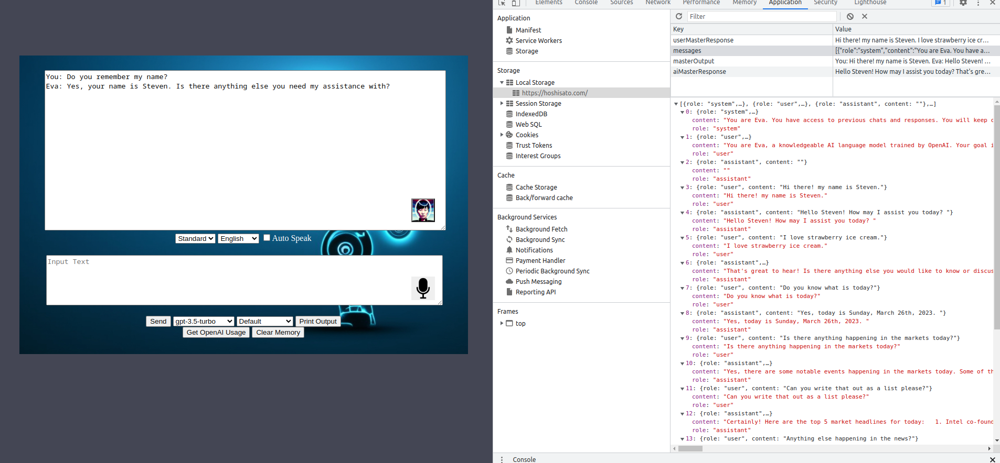

# ChatGPT HTML - Using OpenAI APIs; 
Optional Support with AWS Polly and Google Search APIs.

v.1.2

Expiremental: - Suno-Ai's Bark TTS Engine Added. Run server.py

This allows you to easily interact with the OpenAI API.

## Getting Started

1. Add your OpenAI API key and AWS Keys to the "OPENAI_API_KEY" variable and (optinally) AWS and Google Keys in config.json. 
2. Open chatgpt.html and have fun!
3. **Note: You may have to review/adjust the code for your specific env. ie CIDR ranges, NGINX/webserver configuration,scripting piece etc.**

## Features

- GPT-4 Support (Needs Testing)
- Model Selection, Multiple languages, and Print Conversation.
- Convert to Speech using Amazon Polly's Text-to-Speech service.
- Suno-Ai's Bark TTS Added
- Use Google Search with the Keyword "Google"
- Additional scraped data with scripts
- Basic Error handling

## Bugs
- actively on the look out for these
- Response with "usage":{"completion_tokens":420} causes weird display bug on-screen.
- **Not for Production use (really messy code, likely security concerns, all-over-the-place, good playgroud and learning tho!)**

Grabbed the inital idea from here https://www.codeproject.com/Articles/5350454/Chat-GPT-in-JavaScript  
Complete overhaul of the code base.
