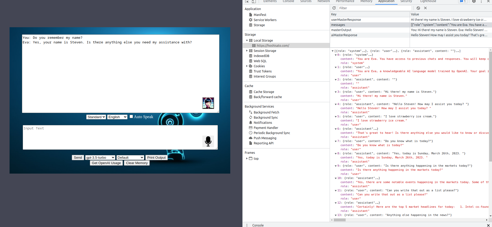

# ChatGPT HTML - Using OpenAI APIs and AWS Polly speech

v.0.5

This allows you to easily interact with the OpenAI API and convert the response to speech using Amazon Polly's Text-to-Speech service.

## Getting Started

1. Add your OpenAI API key and AWS Keys to the "OPENAI_API_KEY" variable and "AWS.config.credentials" in config.json. 
2. Open chatgpt.html and have fun!

## Features

- Model Selection, Multiple languages, and Print Conversation.
- Convert to Speech using Amazon Polly's Text-to-Speech service.
  - Auto Speak! Now avail w00t w00t
- Error handling for issues that may occur during the API call and speech conversion.

## Bugs
- actively on the look out for these
- Response with "usage":{"completion_tokens":420} causes weird display bug on-screen.

Grabbed the inital idea from here https://www.codeproject.com/Articles/5350454/Chat-GPT-in-JavaScript  
Complete overhaul of the code base.
