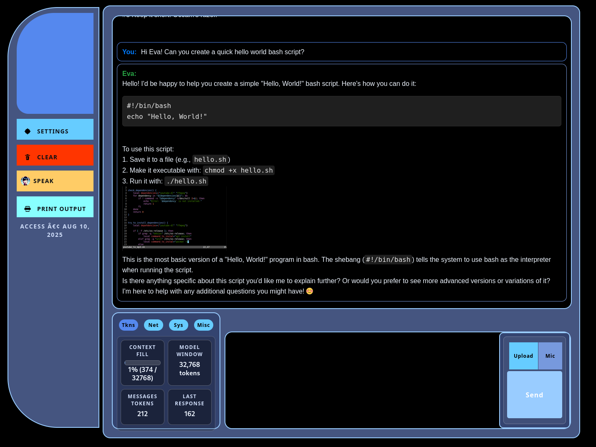

# ChatGPT HTML — Eva AI Assistant


v.5.1

A lightweight web UI for chatting with multiple AI providers. No frameworks, no build steps — just HTML, CSS, and JavaScript.

> **Best experience:** Select **Eva (AIG)** from the model dropdown — persistent memory,
> emotion tracking, proactive data retrieval, and intelligent cross-model orchestration.

## Quick Start

1. Copy `config.example.json` → `config.json` and add your API keys.
2. Open `index.html` in a browser.
3. *(Optional)* For the full Eva experience with persistent memory:
   ```bash
   # Seed the Kusto database (see tools/eva_seed.kql)
   python3 tools/acp_bridge.py --port 8888 \
     --enable-kusto-mcp --kusto-cluster "https://your-cluster.region.kusto.windows.net" \
     --kusto-database Eva
   ```
   Then select **Eva (AIG)** from the model dropdown.

> **Tip:** For local file:// usage, copy `config.local.example.js` → `config.local.js` instead.

## Supported Providers

| Provider | Models | Auth |
|---|---|---|
| **Eva (AIG)** ⭐ | Intelligent orchestration (GPT-4.1 + ACP fallback) | Copilot CLI + optional GitHub PAT |
| **OpenAI** | GPT-4o, o1, o3-mini, GPT-5-mini | OpenAI API Key |
| **GitHub Copilot** (PAT) | GPT-4o, GPT-4o Mini, o3-mini, GPT-4.1, GPT-5, o4-mini | GitHub PAT |
| **GitHub Copilot** (ACP) | Claude, GPT-5.x, Gemini 3 Pro | Copilot CLI |
| **Google Gemini** | Gemini 2.0 Flash Thinking | Gemini API Key |
| **lm-studio** | Any local model | None |
| **DALL-E 3** | Image generation | OpenAI API Key |

## Highlights

- **Eva (AIG)** — persistent memory, emotion tracking, proactive data retrieval
- **Cognition layer** — automatic knowledge extraction, morning reflections, emotion vectors
- **Session explorer** — auto-save/restore conversations across page refresh
- **Voice activation** — wake-word "Eva" with continuous listening
- **MCP tools** — Query Azure Data Explorer (Kusto), GitHub repos, Azure services
- **Settings panel** with tabbed UI (General, Models, Auth, Prompts, MCP)
- **Inline images** — Wikimedia search or DALL-E generation
- **LCARS theme** — Star Trek-inspired interface
- **Text-to-speech** — Amazon Polly and Bark TTS
- **Conversation memory** in localStorage
- **Database seed** — `tools/eva_seed.kql` for quick public setup
- **CI pipeline** — secret scanning, syntax checks, model routing validation

## ACP Bridge (Copilot CLI)

```bash
python3 tools/acp_bridge.py --port 8888
python3 tools/acp_bridge.py --port 8888 --enable-kusto-mcp --kusto-cluster "https://..."
```

Requires: `copilot` CLI installed + authenticated. [Details →](README-2.md#acp-bridge)

## Documentation

See [README-2.md](README-2.md) for architecture, dependencies, and technical details.

## Contributing

See [.github/copilot-instructions.md](.github/copilot-instructions.md) for contribution guidance.

---
*Based on [CodeProject](https://www.codeproject.com/Articles/5350454/Chat-GPT-in-JavaScript). Complete overhaul.*

