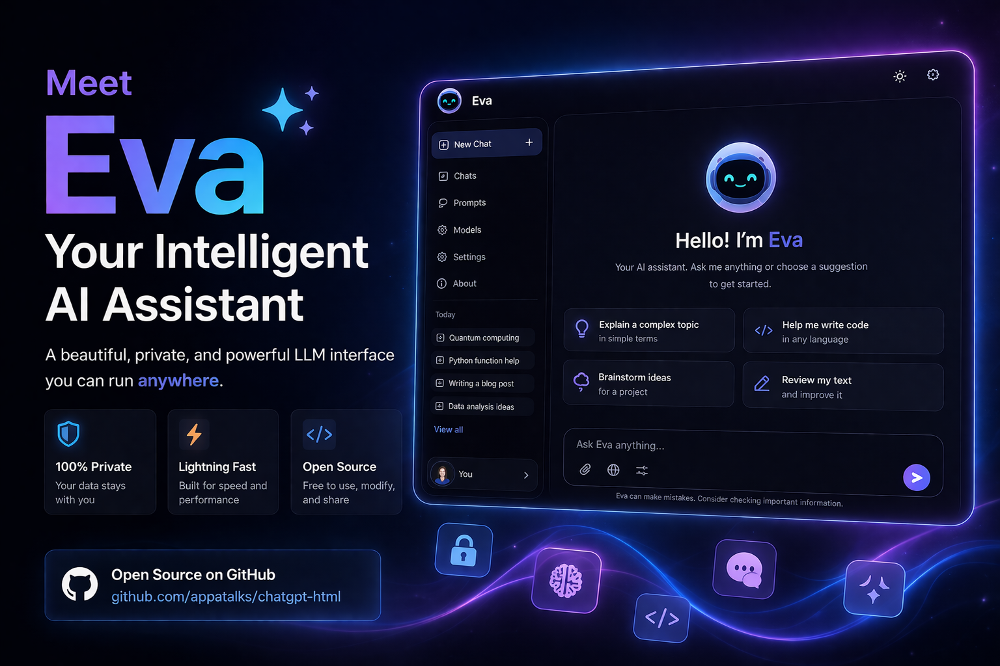

# Eva AI Assistant



A no-build web UI for chatting with multiple AI providers, with persistent memory, emotion tracking, and multi-agent orchestration. Pure HTML, CSS, and JavaScript.

> Recommended: select **Eva (AIG)** in the model dropdown for the full experience.

## Get Started

Download or build the standalone Linux AppImage and run it. The bridge starts automatically on a private localhost port.

```bash
cd standalone
npm install
npm run dist
./dist/'Eva Standalone-5.2.1.AppImage'
```

Prereqs on the host: Node.js 24+, Python 3.12+, GitHub Copilot CLI authenticated (`copilot auth login`). See [standalone/README.md](standalone/README.md).

> **Tip:** For the full Eva experience (persistent memory, emotion tracking, knowledge graph), point Settings > MCP at an Azure Data Explorer cluster you can sign in to. The bridge uses `azure-identity` device code or interactive login on first use, so no keys are stored. Browser-only setup and the manual ACP bridge launch are documented in [README-2.md](README-2.md).

## Documentation

- [README-2.md](README-2.md): architecture, MCP, ACP, browser-only setup, roadmap
- [standalone/README.md](standalone/README.md): AppImage build and runtime

